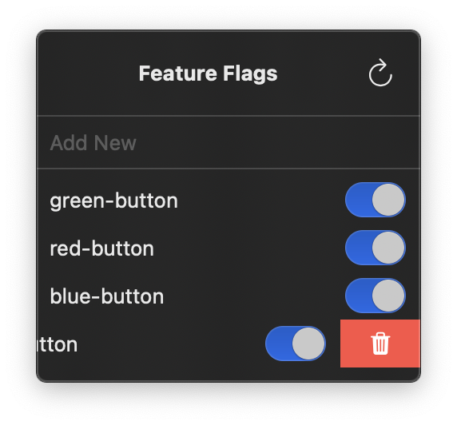

# Baklava for macOS

Welcome to Baklava! Baklava is a macOS application that allows you to interact with your self-hosted instance of [Baklava Server](https://github.com/cembaykara/baklava-server). Baklava Server is a feature flag management system that you need to run locally or host on your own server. With Baklava, you can easily manage your feature flags right on your macOS menubar.

This repository contains the source code for a test macOS client application for the Baklava feature flag system. It's designed to be a menubar app that provides a basic interface for interacting with feature flags managed by a Baklava server.

---

### Features ✨

 This is a test client with limited functionality for demonstration purposes. Currently, it offers:

- ✅ Menubar icon for easy access
- ✅ Basic UI for viewing available feature flags
- ✅ Ability to add and remove feature flags
- ✅ Ability to toggle feature flags
---
 **Important Note:**
    This client requires the [Baklava Server](https://github.com/cembaykara/baklava-server) and a supported database solution.

---

#### Configuring ⚙️
 TODO

#### Contributing 🙌
If you have improvements or additional features you'd like to see, please consider submitting a pull request.
